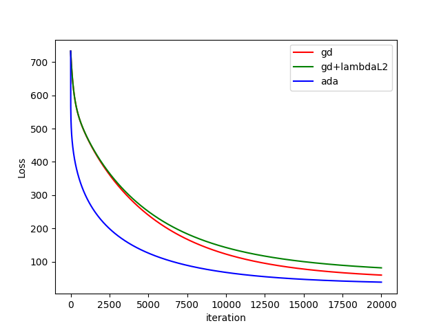
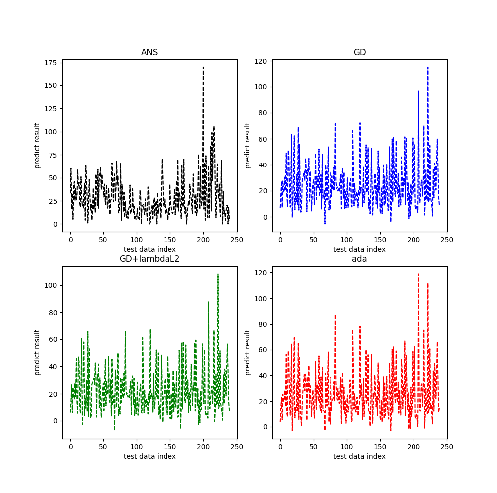

# Hoemwork1  
- data文件夹，包括训练数据train.csv,测试数据test.csv和ans.csv   
- output_picture所用图片源文件    
- Prodict_PM2.5.py代码源文件     
  
---
## Predict PM2.5
- 通过线性回归模型预测PM2.5，简单的将18*9加上一个常量b总共163个变量
* 采用的了简单的GD和Adagrad，正则化用的是L2
+ 其实PM2.5跟其中部分相关，可以查找资料一般跟NO2，NO，SO2等

---
## Result   
20000次迭代得到的cost与迭代次数之间的关系

test数据结果图

